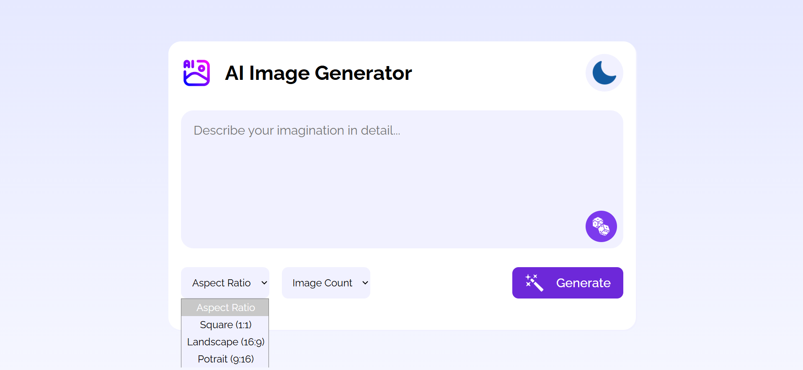
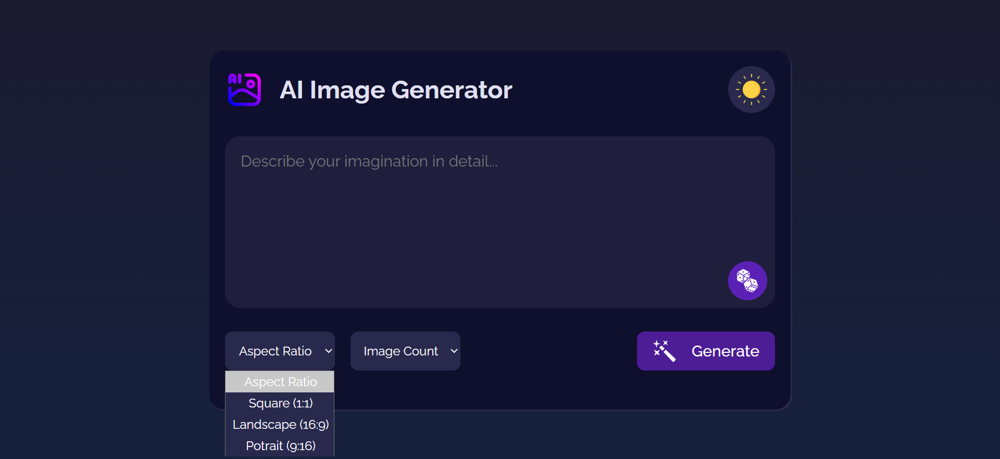

# AI Image Generator

A modern web application for generating AI-powered images from creative text prompts. Built with Vite for fast development and leveraging Hugging Face and ImgBB APIs for image generation and sharing.

---

## 📸 Screenshots

### Light Mode


### Dark Mode


*Light and Dark mode UI previews*

---

## 🚀 Features
- Generate images from detailed text prompts using Hugging Face's image generation API
- Auto-generate creative prompts with a single click
- Choose aspect ratio and number of images
- Download or share generated images (uploads to ImgBB)
- Light/Dark mode toggle
- Responsive, modern UI

---

## 🛠️ Tech Stack
- **Frontend:** Vanilla JavaScript, HTML, CSS
- **Build Tool:** [Vite](https://vitejs.dev/)
- **APIs:** Hugging Face (image generation), ImgBB (image hosting)

---

## ⚙️ Getting Started

### 1. Clone the Repository
```bash
git clone https://github.com/your-username/ai-image-generator.git
cd ai-image-generator
```

### 2. Install Dependencies
```bash
npm install
```

### 3. Configure Environment Variables

This project uses API keys for Hugging Face and ImgBB. **Never commit your keys to source control!**

#### Create a `.env` file in the project root:
```
VITE_HF_TOKEN=your_huggingface_api_key
VITE_IMAGEBB_API_KEY=your_imgbb_api_key
```
- `VITE_HF_TOKEN`: Your Hugging Face API key ([get one here](https://huggingface.co/settings/tokens))
- `VITE_IMAGEBB_API_KEY`: Your ImgBB API key ([get one here](https://api.imgbb.com/))

> **Note:** Vite exposes environment variables prefixed with `VITE_` to your frontend code via `import.meta.env`.

#### Example `.env` file:
```
VITE_HF_TOKEN=hf_xxxxxxxxxxxxxxxxxxxxxxxxxxxxxxxx
VITE_IMAGEBB_API_KEY=xxxxxxxxxxxxxxxxxxxxxxxxxxxxxxxx
```

### 4. Run the Development Server
```bash
npm run dev
```
- The app will be available at `http://localhost:5173` (or as shown in your terminal)

### 5. Build for Production
```bash
npm run build
```
- Output will be in the `dist/` folder

### 6. Preview Production Build
```bash
npm run preview
```

---

## 📝 Usage
1. Enter a creative prompt or click the dice button to auto-generate one.
2. Select aspect ratio and number of images.
3. Click **Generate** to create images.
4. Click an image to preview, download, or share it.

---

## 🔒 Environment Variables & Security
- **Never share your `.env` file or API keys publicly.**
- Add `.env` to your `.gitignore` (Vite does this by default).
- Only variables prefixed with `VITE_` are exposed to the frontend.

---

## 🤝 Contributing
1. Fork the repo
2. Create a new branch (`git checkout -b feature/your-feature`)
3. Commit your changes
4. Push to your branch
5. Open a Pull Request

---

## 📄 License
MIT

---

## 🙋 FAQ
**Q: My API keys aren't working?**
- Double-check your `.env` file and restart the dev server after changes.
- Make sure your keys are valid and have the right permissions.

**Q: How do I get a Hugging Face or ImgBB API key?**
- [Hugging Face tokens](https://huggingface.co/settings/tokens)
- [ImgBB API keys](https://api.imgbb.com/)

---

## 📬 Contact
For questions, open an issue or contact the maintainer. 